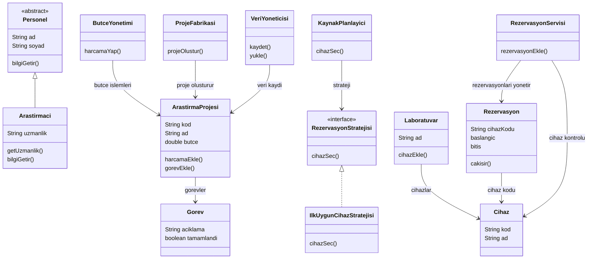

# UML Sınıf Diyagramı

Üniversite Araştırma ve Laboratuvar Yönetimi Sistemi

```mermaid
classDiagram

class Personel {
    <<abstract>>
    String ad
    String soyad
    bilgiGetir()
}

class Arastirmaci {
    String uzmanlik
    getUzmanlik()
    bilgiGetir()
}

class ArastirmaProjesi {
    String kod
    String ad
    double butce
    harcamaEkle()
    gorevEkle()
}

class Gorev {
    String aciklama
    boolean tamamlandi
}

class Laboratuvar {
    String ad
    cihazEkle()
}

class Cihaz {
    String kod
    String ad
}

class Rezervasyon {
    String cihazKodu
    baslangic
    bitis
    cakisir()
}

class ButceYonetimi {
    harcamaYap()
}

class KaynakPlanlayici {
    cihazSec()
}

class VeriYoneticisi {
    kaydet()
    yukle()
}

class RezervasyonServisi {
    rezervasyonEkle()
}

class RezervasyonStratejisi {
    <<interface>>
    cihazSec()
}

class IlkUygunCihazStratejisi {
    cihazSec()
}

class ProjeFabrikasi {
    projeOlustur()
}

Personel <|-- Arastirmaci
ArastirmaProjesi --> Gorev : gorevler
Laboratuvar --> Cihaz : cihazlar
Rezervasyon --> Cihaz : cihaz kodu
ButceYonetimi --> ArastirmaProjesi : butce islemleri
KaynakPlanlayici --> RezervasyonStratejisi : strateji
RezervasyonStratejisi <|.. IlkUygunCihazStratejisi
RezervasyonServisi --> Rezervasyon : rezervasyonlari yonetir
RezervasyonServisi --> Cihaz : cihaz kontrolu
ProjeFabrikasi --> ArastirmaProjesi : proje olusturur
VeriYoneticisi --> ArastirmaProjesi : veri kaydi
```
